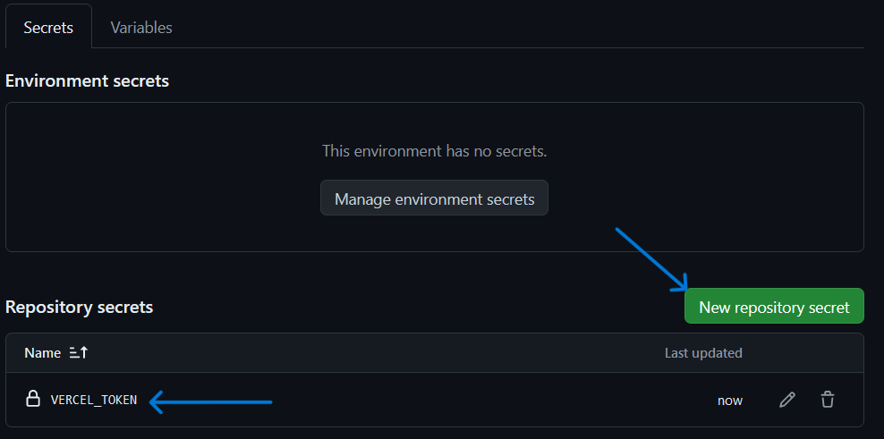

# Repository Treasure-Hunt


## Introduction

Welcome to the Michelin online treasure hunt repository!

This game consists of navigating through several pages, each containing a challenge. As you complete each challenge, you'll be awarded a flag. Collect all the flags to complete the game!

## How to play

1. **Start the game**: Go to the first page of the game ([See Deployment](https://github.com/michelin/treasure-hunt?tab=readme-ov-file#Deployment)).
2. **Solve the challenge**: Each page will contain a unique challenge that you must solve to obtain a flag.
3. **Get the flag**: Once you have solved the challenge, you will be provided with a flag. Make a note of it!
4. **Continue the adventure**: Use the flag to access the next page where a new challenge awaits you.
5. **End the game**: Repeat the process until you have collected all the flags and reached the end of the game.


Flags are of the form `X_S0M3-Str1NgS.html` where X is the challenge number.
For example, a flag could be `1_tH15-15-N0t-TH3-B3g1NN1ng.html`.

## Deployment

### Requirement

- Have a Vercel account. If you don't have one, register at [vercel.com](vercel.com)

### Easy way to deploy

Click on the button : [](https://vercel.com/new/clone?repository-url=https%3A%2F%2Fgithub.com%2Fmichelin%2FMichelin-Jeu-de-Piste&project-name=jeu-de-piste&build-command=python%20static-generator.py&output-directory=.%2Fbuild)

### Local Deploy :

Clone the repository

Install the requirements : `pip install -r requirements.txt`

execute: `python ./static-generator.py && cd build && python ./main.py`

### Deploy in other way :

- Create a Vercel token and put it in the repo secrets under the name `VERCEL_TOKEN`.

<details>
<summary> Token creation details </summary>

In your account details : 


  
go to token :


then create a token (choose the scope and duration)


Copy the token and put it in Settings then Secret Action


Create a new secret :



</details>

### Step to deploy on vercel

- After a push (or commit directly to github), a github action is launched.
- You can go back to vercel to get a url that will lead to the challenge

### Add a scenario 

- Create a folder in the `challenges/` folder (eg. `fun_chall`)
- Inside, place the html file `Fun-Ch4l1.html`.
- Add the config.yml file which will contain
  - title: "{titre du challenge}"
  - description: "{description du challenge}"
  - hint: "{solution du challenge}"
  - template: "Fun-Ch4l1.html" `//html file name`
  - css: "./static/Fun-Ch4l1.css" `//same filename but in ./static `
  - javascript: "./static/Fun-Ch4l1.js"
  - api: "./api.py" `// if necessary to retrieve a POST/PUT request...`
  - encoding_script: "./encoder.sh" `// is used to encode a flag given in $1`
- Add your scripts/stylesheets to the `static` folder
- Make references in your HTML files to your JS scripts or style sheets as follows: 

```html
<link rel="stylesheet" href="{{ url_for('static', path='/Fun-Ch4l1.css') }}">
```

- Add the `./challenges/fun_chall/config.yml` to one of the paths in `paths_config.yml`.

The html file will contain {{flag}} if there is a challenge following it, otherwise it will contain nothing/final flag.

## Support

If you have any questions or problems, don't hesitate to contact our team at treasure-hunt@michelin.com.

Good luck and have fun!

## Fun Fact

We can listen a podcast about this project

[](https://podcast.ausha.co/campus-talent/23-le-jeu-de-piste-de-michelin-avec-paul-amar)
