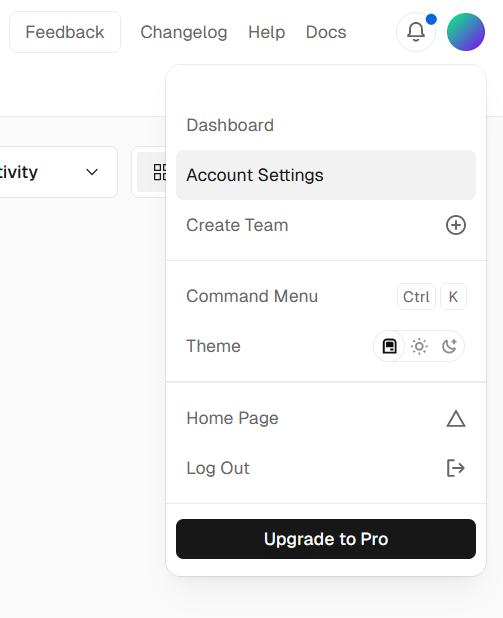
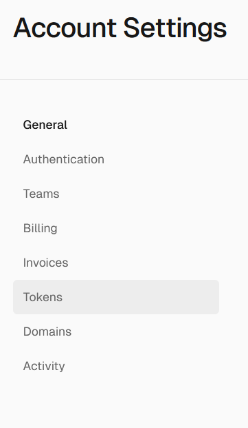
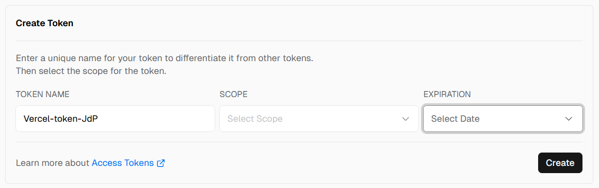
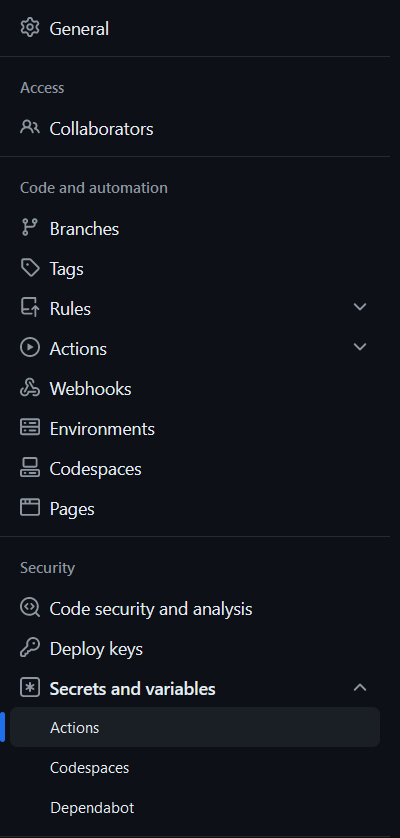

# Repository Jeu de Piste 


## Introduction

Bienvenue sur le repository du jeu de piste en ligne Michelin !

Ce jeu consiste à naviguer à travers plusieurs pages, chacune contenant un défi. En réussissant chaque défi, vous obtiendrez un flag. Collectez tous les flags pour terminer le jeu !

## How to play

1. **Commencez le jeu** : Rendez-vous sur la première page du jeu ([Voir déployment](https://github.com/michelin/treasure-hunt?tab=readme-ov-file#Deployment)).
2. **Résolvez le défi** : Chaque page contiendra un défi unique que vous devrez résoudre pour obtenir un flag.
3. **Obtenez le flag** : Une fois le défi résolu, un flag vous sera fourni. Notez-le bien !
4. **Continuez l'aventure** : Utilisez le flag pour accéder à la page suivante où un nouveau défi vous attend.
5. **Terminez le jeu** : Répétez le processus jusqu'à ce que vous ayez collecté tous les flags et atteint la fin du jeu.

Les flags sont de la forme `X_S0M3-Str1NgS.html` où X est le numéro du challenge.
Par exemple un flag pourrait être : `1_tH15-15-N0t-TH3-B3g1NN1ng.html`

## Deployment

### Requirement

- Avoir un compte Vercel. Si vous n'en avez pas, inscrivez-vous sur [vercel.com](vercel.com)

### Easy way to deploy

(Non fonctionnel pour le moment)
Clickez sur le bouton : [](https://vercel.com/new/clone?repository-url=https%3A%2F%2Fgithub.com%2FR4ph3uz%2FMichelin-Jeu-de-Piste&project-name=jeu-de-piste&build-command=python%20static-generator.py&output-directory=.%2Fbuild)

### Local Deploy :

Clone the repository

Install the requirements : `pip install -r requirements.txt`

execute: `python ./static-generator.py && cd build && python ./main.py`

### Deploy in other way :

- Créez un token Vercel et mettez le dans les secrets du repo sous le nom `VERCEL_TOKEN`

<details>
<summary> Detail de la création de Token </summary>

Dans les détails de votre compte : 


  
allez dans token :



puis créez un token (choisissez le scope et la durée)



Copiez le token et mettez le dans Settings puis Secret Action



Créez un nouveau secret :


</details>

### Step to deploy on vercel

- Après un push (ou commit directement sur github) un github action se lance.
- Vous pouvez retourner sur vercel récupérer un url qui mènera au challenge

### Add a scenario 

- Créez un dossier dans le dossier `challenges/` (eg. `fun_chall`)
- A l'interieur placez le fichier html `Fun-Ch4l1.html`
- Ajoutez le hichier config.yml qui contiendra
  - title: "{titre du challenge}"
  - description: "{description du challenge}"
  - hint: "{solution du challenge}"
  - template: "Fun-Ch4l1.html" `//nom du fichier html`
  - css: "./static/Fun-Ch4l1.css" `//meme nom de fichier mais dans ./static `
  - javascript: "./static/Fun-Ch4l1.js"
  - api: "./api.py" `// si nécéssaire pour récuperer un POST/PUT...`
  - encoding_script: "./encoder.sh" `// permet d'enoder un flag fourni en $1`
- Rajoutez vos scripts/feuilles de style CSS dans le dossier `static`
- Faites références dans vos fichiers HTML à vos scripts JS ou feuilles de style de la manière suivante : 

```html
<link rel="stylesheet" href="{{ url_for('static', path='/Fun-Ch4l1.css') }}">
```

- Ajoutez le `./challenges/fun_chall/config.yml` dans un des paths de `paths_config.yml`

Le fichier html contiendra {{flag}} si il y a un challenge qui le suit sinon contiendra rien/flag final.

## Support

Si vous avez des questions ou des problèmes, n'hésitez pas à contacter notre équipe à l'adresse suivante : treasure-hunt@michelin.com

Bonne chance et amusez-vous bien !